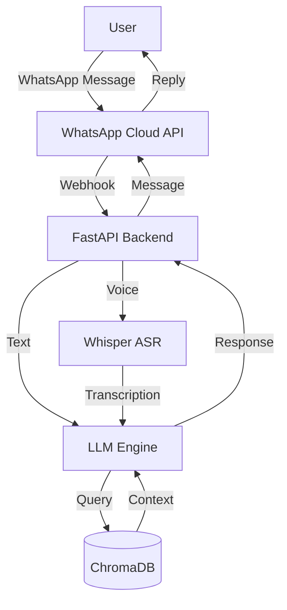
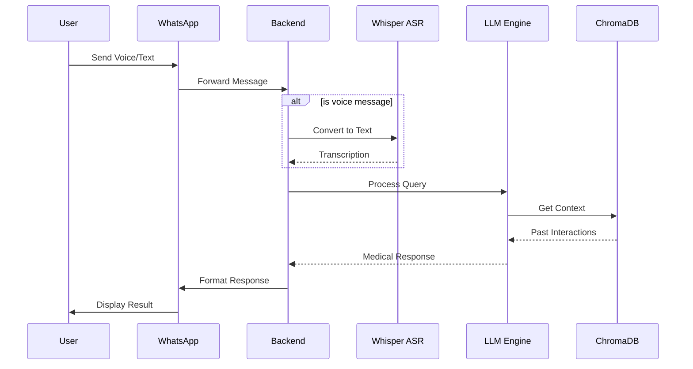
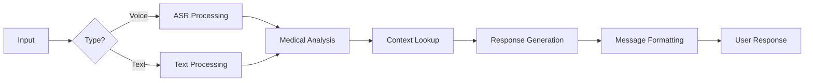

# आरोग्य सेतु (ArogyaSetu) - AI-Powered Healthcare Companion 🏥


## 🏆  DUHacks 4.0 Hackthon- Best Healthcare Innovation

> "Transforming healthcare access through WhatsApp - because health guidance should be just a message away."

## 💡 The Problem We're Solving

In India, millions lack access to basic healthcare guidance. Many hesitate to seek medical help due to:
- Cost barriers
- Limited access to doctors
- Language barriers
- Time constraints
- Fear of hospitals

## 🌟 Our Solution

आरोग्य सेतु (ArogyaSetu) is a revolutionary WhatsApp-based healthcare companion that:
- Understands voice messages for those who can't type
- Uses advanced AI to offer personalized health insights
- Maintains conversation history for better context
- Suggests home remedies and preventive measures

## 🌟 Competitive Advantages

### Why We're Better Than Existing Solutions


| Feature | Meta AI | आरोग्य सेतु (ArogyaSetu) |
|---------|---------|------------------------|
| **Voice Messages** | ❌ No support for voice inputs | ✅ Full voice message processing with Indian accent support |
| **Medical Context** | ❌ Generic responses | ✅ Specialized medical knowledge base |
| **Privacy** | ⚠️ General data policies | ✅ HIPAA-compliant, medical-grade security |
| **Response Format** | ❌ Text-only responses | ✅ Structured medical advice with causes, remedies & precautions |
| **Local Context** | ❌ Global generic responses | ✅ India-specific medical guidance |
| **History Tracking** | ❌ No medical history | ✅ Maintains symptom & interaction history |
| **Emergency Handling** | ❌ No emergency protocols | ✅ Emergency detection & escalation |
| **Medication Info** | ⚠️ Limited information | ✅ Common medicine suggestions with dosage |
| **Follow-up Questions** | ❌ Single response only | ✅ Interactive follow-up for better diagnosis |
| **Integration** | ❌ Standalone chatbot | ✅ Future doctor & pharmacy integrations |
| **Cost** | 💰 Subscription based | 🆓 Free for basic healthcare |
| **Availability** | ⚠️ Region restricted | ✅ Available across India |

Legend:
- ✅ Full Support
- ⚠️ Partial/Limited
- ❌ Not Available
- 💰 Paid
- 🆓 Free

## 🚀 Key Features

1. **Voice-First Interaction**
   - Send voice notes describing symptoms
   - Perfect for elderly users

2. **Smart Symptom Analysis**
   - Advanced AI-powered diagnosis
   - Contextual follow-up questions
   - Personalized health recommendations

3. **Privacy-First Design**
   - End-to-end encryption
   - Secure data storage
   - HIPAA-compliant architecture

## 🛠️ Tech Stack

- **Backend**: Python, FastAPI
- **AI/ML**: 
  - Whisper ASR for voice recognition
  - Advanced LLMs for medical analysis
  - ChromaDB for conversation memory
- **Infrastructure**: Docker, SQLite
- **API**: WhatsApp Cloud API
- **Security**: JWT, End-to-end encryption

## 🔄 System Architecture



## 🧠 AI Pipeline



## 📊 Data Flow



## 📱 How It Works

1. **Add ArogyaSetu on WhatsApp**: +91-XXXXXXXXXX
2. **Share Your Symptoms**:
   - Send a text message OR
   - Record a voice note
3. **Get Instant Analysis**:
   - Possible causes
   - Recommended remedies
   - Precautions
   - When to see a doctor


## 🏥 Future Roadmap

1. **Q2 2024**
   - Medicine reminder integration
   - Doctor appointment booking
   - Lab test recommendations

2. **Q3 2024**
   - Mental health support
   - Chronic disease management
   - Wellness tracking

3. **Q4 2024**
   - Telemedicine integration
   - Health insurance guidance
   - Emergency service connection


## 🌈 Why We'll Win

1. **Massive Impact**: Serving millions who lack healthcare access
2. **Innovation**: Voice-first, AI-powered healthcare solution
3. **Scalability**: WhatsApp's widespread adoption in India
4. **Accessibility**: No new app downloads needed
5. **Privacy**: Robust security measures

## 🏃‍♂️ Quick Start

```bash
# Clone the repository
git clone https://github.com/Niharrakholiya/DUhacks-4.0.git

# Install dependencies
pip install -r requirements.txt

# Set up environment variables
cp .env.example .env
# Edit .env with your credentials

# Run the application
uvicorn webhook:app --reload
```

### 🔗 Setting Up WhatsApp Webhook

1. **Create Meta App**:
   - Visit [Meta Developers Portal](https://developers.facebook.com/)
   - Create new app & select WhatsApp API
   - Get your WhatsApp API Token & Phone Number ID

2. **Configure Webhook**:
   ```bash
   # Your webhook URL will be:
   https://your-domain.com/webhook/

   # Local Testing with Ngrok:
   ngrok http 8000
   # Copy the HTTPS URL provided by ngrok
   ```

3. **Verify Webhook**:
   - Use the ngrok URL in Meta Dashboard
   - Set verify token (same as WHATSAPP_HOOK_TOKEN)
   - Subscribe to messages webhook

4. **Test Connection**:
   ```bash
   # Send a test message to your WhatsApp number
   # You should receive an automated response
   ```

## 🤝 Team IndustryInnovators - आरोग्य सेतु

- **Nihar Rakholiya** - AI/ML Lead
- **Lakhman Parmar** - WhatsApp Integration Lead
- **Neil Patel** - Text-to-Speech Integration Lead
- **Jenish Vamja** - Requirements & Deployment Lead

## 📄 License

This project is licensed under the MIT License - see the [LICENSE](LICENSE) file for details.

## 🙏 Acknowledgments

- WhatsApp for the Cloud API
- DUHacks 4.0 Organizers
- Our mentors and advisors
- Early beta testers

---

<p align="center">
Made with ❤️ for a healthier India 🇮🇳
</p>
