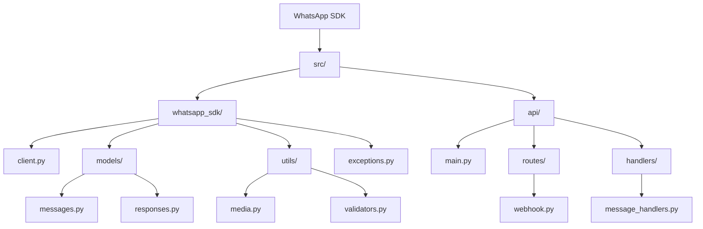

# WhatsApp Cloud API SDK

A Python SDK for the WhatsApp Cloud API that handles messages, media, and webhooks.

## Project Structure


## Features
- Text message sending/receiving


MIT License## License4. Submit a pull request3. Add tests for new features2. Create your feature branch1. Fork the repository## Contributing- MessageSendError: Message sending failures- MediaDownloadError: Media download issues- MediaUploadError: Media upload failures- WhatsAppError: Base exceptionThe SDK includes comprehensive error handling:## Error Handling- Video: mp4, 3gp- Documents: pdf, doc, docx, xls, xlsx, ppt, pptx- Audio: ogg, mp3, wav, aac- Images: jpg, png, gif, webp## Media Support```https://your-domain.com/webhook```2. Configure your webhook URL in the Meta Developer Portal:```uvicorn api.main:app --host 0.0.0.0 --port 8000 --reload```bash1. Start the FastAPI server:## Webhook Setup```)    file_path="path/to/audio.ogg"    to="1234567890",client.send_audio_message(# Send media)    message="Hello from WhatsApp SDK!"    to="1234567890",client.send_text_message(# Send text messageclient = WhatsAppClient(config))    webhook_token=os.getenv("WHATSAPP_HOOK_TOKEN")    cloud_number_id=os.getenv("WHATSAPP_CLOUD_NUMBER_ID"),    api_token=os.getenv("WHATSAPP_API_TOKEN"),    api_url=os.getenv("WHATSAPP_API_URL"),config = WhatsAppConfig(from whatsapp_sdk import WhatsAppClient, WhatsAppConfig```python3. Basic Usage:```WHATSAPP_HOOK_TOKEN=your_webhook_tokenWHATSAPP_CLOUD_NUMBER_ID=your_phone_number_idWHATSAPP_API_TOKEN=your_token_hereWHATSAPP_API_URL=https://graph.facebook.com/v18.0/```env2. Set up environment variables (.env):```pip install -r requirements.txt```bash1. Install the package:## Quick Start- Error handling and logging- Template messages- Webhook processing- Media handling (images, audio, documents, video)
