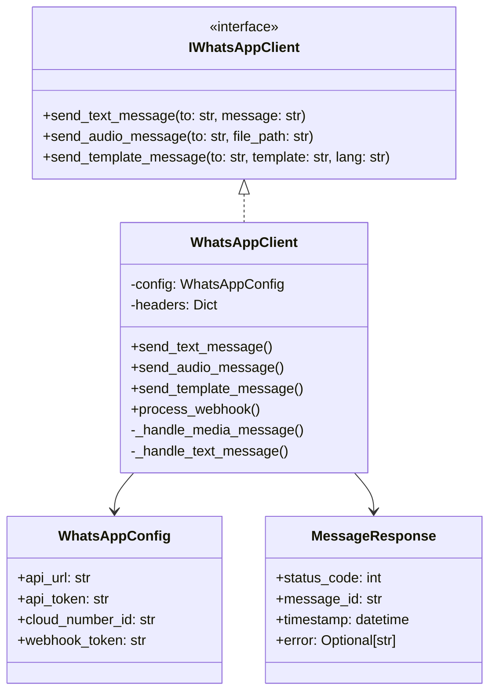

# WhatsApp SDK API Documentation

## Class Diagram


## API Methods

### Text Messages
```python
send_text_message(to: str, message: str) -> MessageResponse
```

### Media Messages
```python
send_audio_message(to: str, file_path: str) -> MessageResponse
download_media(media_id: str, media_type: str, phone_number: str) -> str
```

### Templates
```python
send_template_message(to: str, template_name: str, language_code: str) -> MessageResponse
```

## Webhook Flow
```mermaid
sequenceDiagram
    participant WhatsApp
    participant Webhook
    participant Handler
    participant Storage

    WhatsApp->>Webhook: Send Message Event
    Webhook->>Handler: Process Notification
    Handler->>Storage: Save Media (if any)
    Handler->>WhatsApp: Send Response
    WhatsApp->>Handler: Delivery Status
